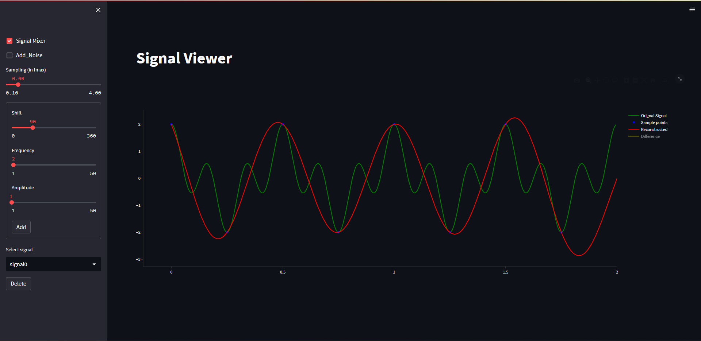
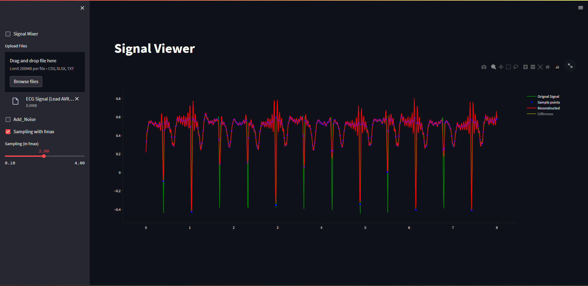

# Sampling-Theory-Studio
A webapp that demonstrates Niquist's sampling theorum
- useres can upload signals
- uploaded signal is plotted
- the user select sampling frequency and the recnostructed signal is plotted along with a plot for the difference
- an option to add noise
- a signal mixer that allows users to generate their own signals by specifying the frequency amplitude and phase shift of either a sine or a cosine wave
- the output signal is saved in a csv file
- user can modify the signals mixed and delete them
- the same features as the original app to sample and add noise

  # Preview
  - 
  - 
